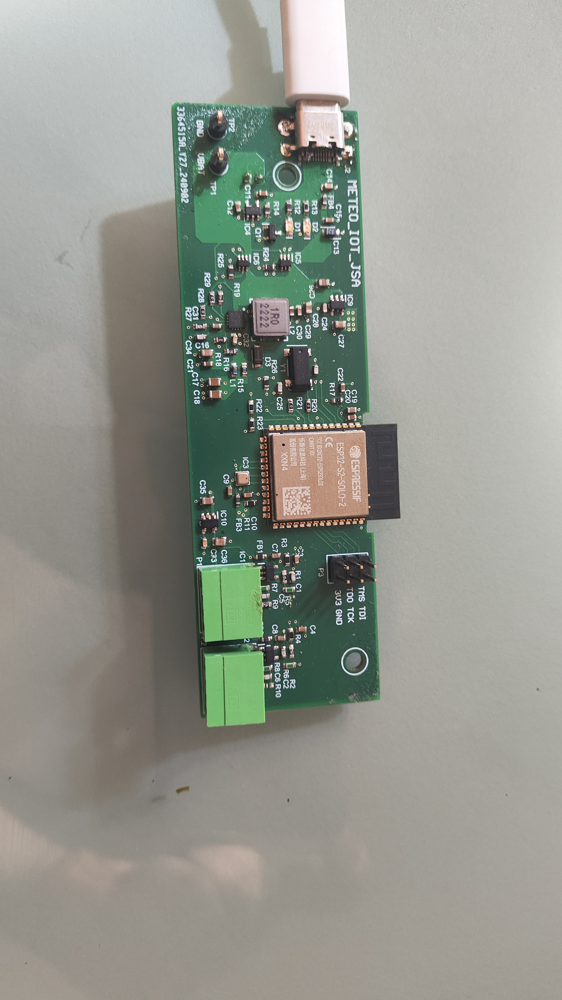

# METEO-IOT
**Meteo IoT** is an open-source project for environmental data collection, focusing on wind speed, wind direction, temperature, pressure, and humidity. This data is transmitted via WiFi using the MQTT protocol, making it compatible with IoT platforms.

## Features

* Wind Speed & Direction: Supports the external sensors ZTS-3000-FSJT-V05 and ZTS-3000-FXJT-V05.
* Can be powered via USB Type-C or a LiPo battery
* Integrated air quality sensor in PCB.
* Uses microcontroller ESP32-S2 to acquiere, process and send data via MQTT over WiFi.
* Free-RTOS code coming soon!

